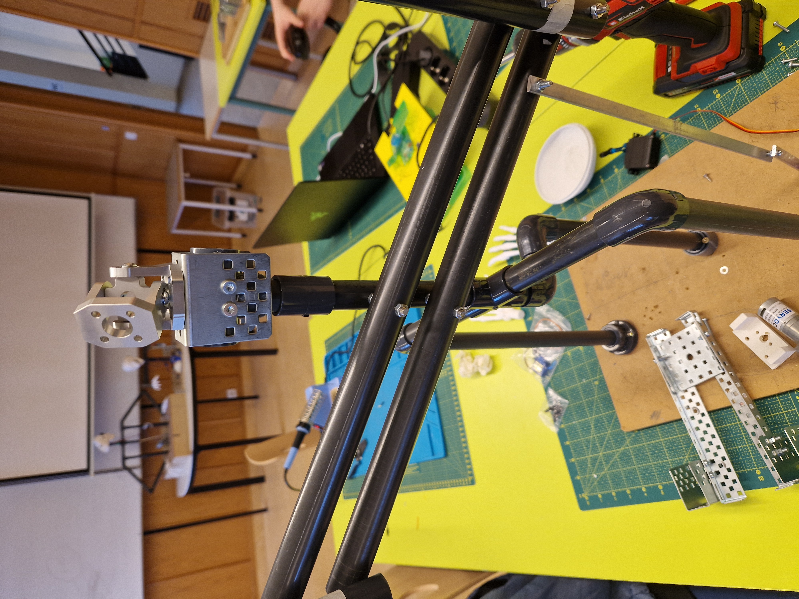

# VESM1 Verkefni 5 

Árni, Davíð, Hörður og Sebastían.

## Virkni og notkun

Myndband af hreyfingu á höfuðkúpu

Myndband af hreyfing á búk

## Ljósmyndir
 

Grindinn

## Lýsing, efni, mælingar, höfundar og heimildir

### Lýsing

[Kóðinn](./Efni/K%C3%B3%C3%B0i/code_Samsettning/code_Samsettning.ino)

### Efni
---------
| FJÖLDI | EFNI|
|------|------|
| 2 | Rautt led|
| 1 | HC-SR04 Ultrasonic (Fjarlægðaskynjari)|
| 1 | Arduino |
| 2 | Hátalari |
| 1 | DC motor|
| 1 | Micro servo|
| 1 | DFPlayer mp3|
| 10 | PVC pípur|
| 1 | Breadboard|
| 1 | L298N motor controller|
| 1 | External Power Supply SPS305|
| | | 

### Heimildir
--------
[Upplýsingar um Ultrasonic Sensor](https://lastminuteengineers.com/arduino-sr04-ultrasonic-sensor-tutorial/)

[Tónlist](https://github.com/HordurPalsson/VESM1-Verkefni-5/blob/main/Tonlist)

[Servo motor](https://lastminuteengineers.com/servo-motor-arduino-tutorial/)

[Tímaverkefni 4](https://github.com/VESM1VS/AFANGI/blob/main/Verkefni/Verkefni4.md)

[Arduino gögn](https://reference.arduino.cc/reference/en/)

[Kóðinn fyrir hreyfingu á mekatrónik](https://github.com/VESM1VS/AFANGI/blob/main/Kennsluefni/forritun_lokaverkefni.md)
